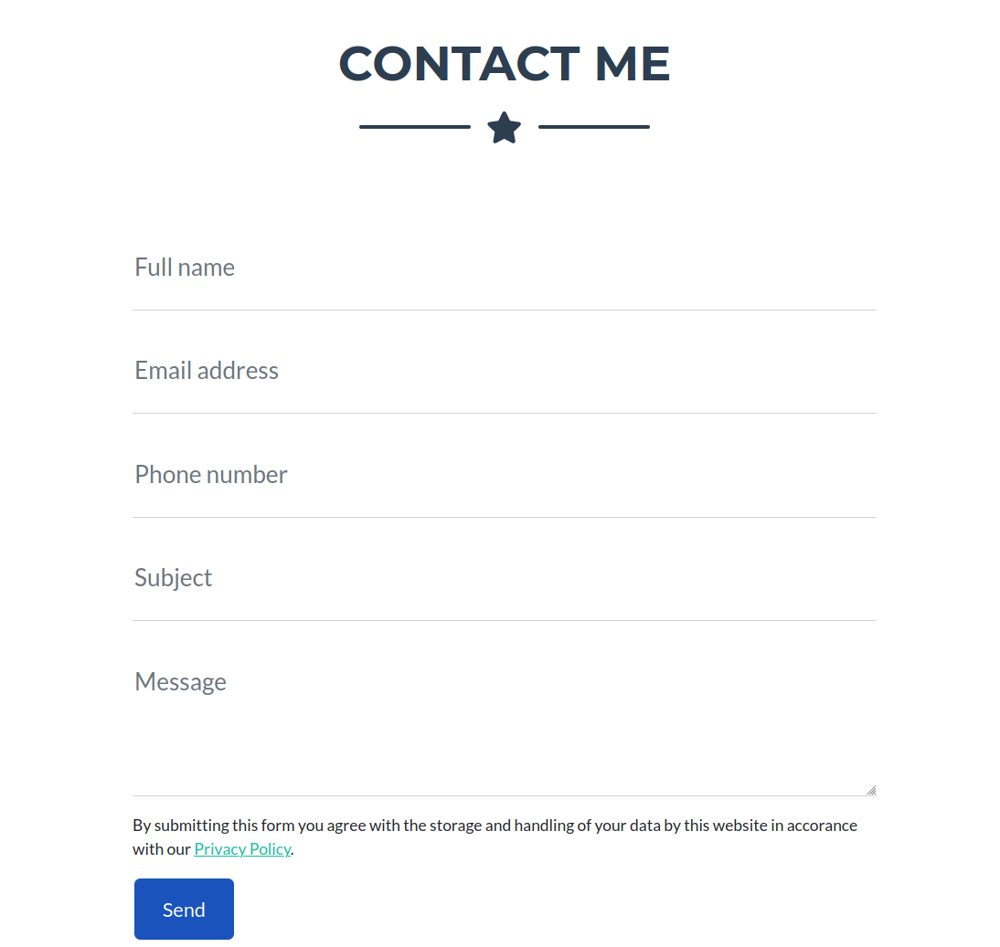

# ⚪ Stacked(Linux, Insane)


### Содержание:

В самом начале мы просканируем порты, профаззим поддомены и найдем один, на котором будет XSS в HTTP заголовке Referer. C помощью данной XSS мы найдем еще один поддомен и прочитаем почтовые сообщения. В этих сообщениях будет поддомен с AWS Lambda. Затем эксплуатируем вулну через создание lambda-функции и получим реверс шелл. На хосте запустим PSPY и увидим выполнение lambda-функций, которые выполняются от рута.

### Сканируем порты с помощью nmap:

```
$ nmap -sC -sV 10.10.11.112 -oN nmap
```

```
PORT   STATE SERVICE VERSION
22/tcp open  ssh     OpenSSH 8.2p1 Ubuntu 4ubuntu0.3 (Ubuntu Linux; protocol 2.0)
| ssh-hostkey: 
|   3072 12:8f:2b:60:bc:21:bd:db:cb:13:02:03:ef:59:36:a5 (RSA)
|   256 af:f3:1a:6a:e7:13:a9:c0:25:32:d0:2c:be:59:33:e4 (ECDSA)
|_  256 39:50:d5:79:cd:0e:f0:24:d3:2c:f4:23:ce:d2:a6:f2 (ED25519)
80/tcp open  http    Apache httpd 2.4.41
|_http-title: Did not follow redirect to http://stacked.htb/
|_http-server-header: Apache/2.4.41 (Ubuntu)
Service Info: Host: stacked.htb; OS: Linux; CPE: cpe:/o:linux:linux_kernel
```

.png>)

С формой я сделать так ничего и не смог, поэтому пошел дальше.

Так как в тегах \<title>STACKED.HTB\</title>, то скорее всего, это реальное имя домена, следовательно вносим его в /etc/hosts и можно фаззить поддомены.

```
$ gobuster vhost -w /opt/SecLists/Discovery/DNS/subdomains-top1million-5000.txt -u stacked.htb -t 20 | grep -v "(Status: 302)"
```

```
Found: portfolio.stacked.htb (Status: 200) [Size: 30268]
```


На главной странице поддомена расположены логотипы различных технологий и ОС: docker, aws labmda,  localstack, fullstack, ubuntu, debian, centos. Это дает отсылку на то, с чем мы будем иметь дело чуть позже.

На странице есть docker-compose.yml:

```yaml
version: "3.3"
services:
  localstack:
    container_name: "${LOCALSTACK_DOCKER_NAME-localstack_main}"
    image: localstack/localstack-full:0.12.6
    network_mode: bridge
    ports:
      - "127.0.0.1:443:443"
      - "127.0.0.1:4566:4566"
      - "127.0.0.1:4571:4571"
      - "127.0.0.1:${PORT_WEB_UI-8080}:${PORT_WEB_UI-8080}"
    environment:
      - SERVICES=serverless
      - DEBUG=1
      - DATA_DIR=/var/localstack/data
      - PORT_WEB_UI=${PORT_WEB_UI- }
      - LAMBDA_EXECUTOR=${LAMBDA_EXECUTOR- }
      - LOCALSTACK_API_KEY=${LOCALSTACK_API_KEY- }
      - KINESIS_ERROR_PROBABILITY=${KINESIS_ERROR_PROBABILITY- }
      - DOCKER_HOST=unix:///var/run/docker.sock
      - HOST_TMP_FOLDER="/tmp/localstack"
    volumes:
      - "/tmp/localstack:/tmp/localstack"
      - "/var/run/docker.sock:/var/run/docker.sock"version: "3.3"

services:
  localstack:
    container_name: "${LOCALSTACK_DOCKER_NAME-localstack_main}"
    image: localstack/localstack-full:0.12.6
    network_mode: bridge
    ports:
      - "127.0.0.1:443:443"
      - "127.0.0.1:4566:4566"
      - "127.0.0.1:4571:4571"
      - "127.0.0.1:${PORT_WEB_UI-8080}:${PORT_WEB_UI-8080}"
    environment:
      - SERVICES=serverless
      - DEBUG=1
      - DATA_DIR=/var/localstack/data
      - PORT_WEB_UI=${PORT_WEB_UI- }
      - LAMBDA_EXECUTOR=${LAMBDA_EXECUTOR- }
      - LOCALSTACK_API_KEY=${LOCALSTACK_API_KEY- }
      - KINESIS_ERROR_PROBABILITY=${KINESIS_ERROR_PROBABILITY- }
      - DOCKER_HOST=unix:///var/run/docker.sock
      - HOST_TMP_FOLDER="/tmp/localstack"
    volumes:
      - "/tmp/localstack:/tmp/localstack"
      - "/var/run/docker.sock:/var/run/docker.sock"
```

Отсюда мы можем узнать, что используется версия localstack - 0.12.6, в котором есть уязвимость CVE-2021-32090([https://blog.sonarsource.com/hack-the-stack-with-localstack](https://blog.sonarsource.com/hack-the-stack-with-localstack)), через которую можно выполнить OS Command Injection, а также он расположен на 8080 веб-порте.

Также на поддомене распологается форма:



